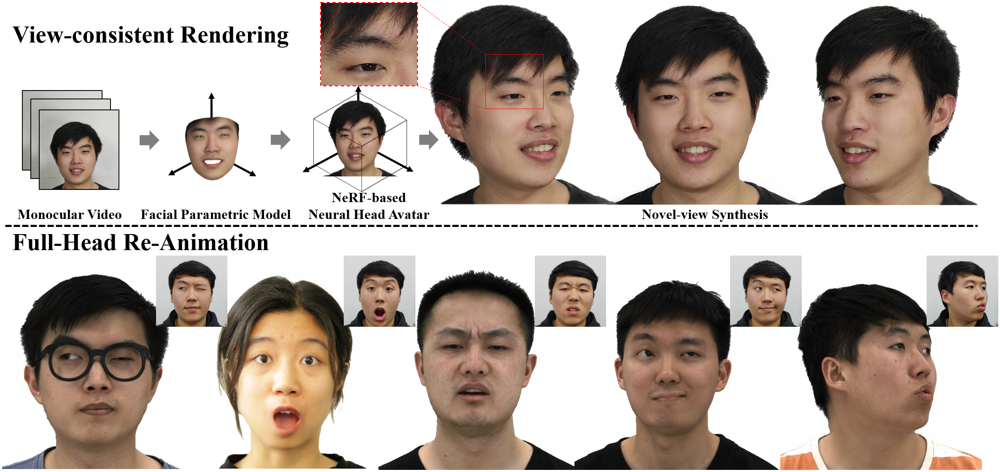

## Under Construction
## HAvatar: High-fidelity Head Avatar via Facial Model ConditionedNeural Radiance Field



**HAvatar: High-fidelity Head Avatar via Facial Model ConditionedNeural Radiance Field**<br>
[Xiaochen Zhao](https://xiaochen-zhao.netlify.app/), [Lizhen Wang](https://lizhenwangt.github.io/), [Jingxiang Sun](https://mrtornado24.github.io/), [Hongwen Zhang](https://hongwenzhang.github.io/), Jinli Suo, [Yebin Liu](http://www.liuyebin.com/)<br><br>


[**Project**](https://www.liuyebin.com/havatar/) | [**Paper**](https://arxiv.org/abs/2309.17128)

Abstract: *The problem of modeling an animatable 3D human head avatar under light-weight setups is of significant importance but has not been well solved. Existing 3D representations either perform well in the realism of portrait images synthesis or the accuracy of expression control, but not both. To address the problem, we introduce a novel hybrid explicit-implicit 3D representation, Facial Model Conditioned Neural Radiance Field, which integrates the expressiveness of NeRF and the prior information from the parametric template. At the core of our representation, a synthetic-renderings-based condition method is proposed to fuse the prior information from the parametric model into the implicit field without constraining its topological flexibility. Besides, based on the hybrid representation, we properly overcome the inconsistent shape issue presented in existing methods and improve the animation stability. Moreover, by adopting an overall GAN-based architecture using an image-to-image translation network, we achieve high-resolution, realistic and view-consistent synthesis of dynamic head appearance. Experiments demonstrate that our method can achieve state-of-the-art performance for 3D head avatar animation compared with previous methods.*


## Train Avatar

### Prepare Dataset

We provide a processed [demo dataset](https://drive.google.com/file/d/1hDM5jhS30QWu7qNHFQhlxxNPiL9oguaI/view?usp=sharing). Please download and unzip it into `data/demo`.

We also provide preprocessing code in `data_preprocessing`. If you want to generate dataset from the video, please download [faceverse file](https://drive.google.com/file/d/1lv2lGiTZet1pMIX4gUVy_wD4VYDOq1Tz/view?usp=drive_link) (`data_preprocessing/metamodel/v3/faceverse_v3_1.npy`) and [RVM pretrained models](https://github.com/PeterL1n/RobustVideoMatting/releases/download/v1.0.0/rvm_resnet50_fp32.torchscript) (`data_preprocessing/BgMatting_models/rvm_resnet50_fp32.torchscript`).

```.bash
cd data_preprocessing
python fit_video.py --video_path path/to/your/video --base_dir data/avatar
```


### Training

```.bash
# Stage one

python train_avatar.py --datadir data/demo --logdir logs/demo
```

After convergence (we train about 20000 steps in this case, you can check the loss with tensorboard), continue with the second training stage. To accelerate the convergence, we provide a [pretrained image translation module](https://drive.google.com/file/d/1Ltfs8LzWLLjcYy4pDXNbMBMrrc3kh8gN/view?usp=sharing). Please download an put it into `pretrained_models`.

```.bash
# Stage two

python train_avatarHD.py --datadir data/demo --logdir logs/demo/HD --ckpt logs/demo/checkpoint200000.ckpt
```

## Animate Avatar

### Self-Reenactment
```.bash
python avatarHD_reenactment.py --torch_test --savedir results/demo/self-recon --ckpt logs/demo/HD/latest.pt --split data/demo/sv_v31_all.json
```

### Cross-Reenactment

```.bash
# preprocess dataset

cd data_preprocessing
python fit_video.py --video_path path/to/your/actor_video --base_dir data/actor --avatar_tracking_dir data/demo
```

```.bash
python avatarHD_reenactment.py --torch_test --savedir results/demo/cross-reenact --ckpt logs/demo/HD/latest.pt --split data/actor/drive_demo.json
```
